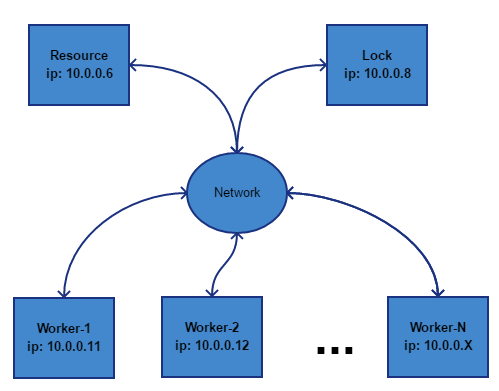

# redis_based_lock
Network accessible lock based on Redis


## Problem

Imagine situation when you have once resource which must be accessed just be one worker at the moment. Sound like job for [mutex](https://en.wikipedia.org/wiki/Mutual_exclusion), is't it? But let's imagine a little bit harder situation - your workers will be executed on different machines at network.



So you need to implement resource lock accessible via network.

Also, you may want to implement resource lock with [watch-dog](https://en.wikipedia.org/wiki/Watchdog_timer). In this case worker shall confirm (time by time) that worker is still active. So, in case when worker does not confirm his activity for long time interval lock will be released.

## Solution

### General information

We can use [Redis](https://redis.io/) to achive this functionality. We can achive our goal just by using [SET](https://redis.io/commands/set) command and one Key-Value pair.

The main idea is to try set value with `NX` parameter (only set the key if it does not already exist) and check return value. If return value is `OK`, that means that you successfully locked resource and can perform your actions.

### Simple scenario

#### Locking 

Taking lock with name `my_lock_name`. For example you can use ISO timestamp as value:

 `SET my_lock_name "2017-08-21 11:35:00" NX`

After command executed you can check return code, when locking was successful, you will receive `OK` as result.

#### Releasing lock

To release lock you should execute:

`DEL my_lock_name`

You shall receive `"1"` if operation was successful.

### Complex scenario with watch-dog

#### General information

We want lock resource for long period (for example for 5 minutes) and use something like watch-dog scenario. So, we will lock resource for 30 seconds, and will update TTL **each** 20 seconds. If worker will die lock will be released automatically.

#### Locking for timeout

Taking lock with name `my_lock_name` for 30 seconds. As described above example you can use ISO timestamp as value:

 `SET my_lock_name "2017-08-21 11:35:00" NX EX 30`

After command executed you can check return code, when locking was successful, you will receive `OK` as result.

In this case we will use `EX` parameter (set the specified expire time, in seconds). If we will not execute this command again in 30 seconds, lock will be released automatically.

#### Updating lock TTL

You can update TTL just by running:

`EXPIRE my_lock_name 30`

You shall receive `"1"` if operation was successful, otherwise you will receive `"0"`

#### Releasing lock

To release lock you should execute:

`DEL my_lock_name`

You shall receive `"1"` if operation was successful.

## Source code

### Description

In this example `WORKERS_COUNT` workers want lock single resource for random time (min = `WORK_LOCK_MIN_SECS` and max = `WORK_LOCK_MAX_SECS`), all experiment will take at least `EXPERIMENT_TIME_SECS` seconds.

Each worker will take resouce for random time (integer value) min = `WORK_MIN_SECS` and max=`WORK_MAX_SECS` seconds.

If worker will not prolongate resource lock more than `MAX_LOCK_TIME_WITHOUT_CONFIRMATION` seconds, resource will be released automatically.

Each worker will perform atomic operations with random durations between min = `ATOMIC_LOCK_TIME_MIN_SEC` and max = `ATOMIC_LOCK_TIME_MAX_SEC` seconds. After atomic action performed, resouce will be locked again up to `MAX_LOCK_TIME_WITHOUT_CONFIRMATION` seconds.

You can notice that `ATOMIC_LOCK_TIME_MAX_SEC` must be less than `MAX_LOCK_TIME_WITHOUT_CONFIRMATION`.

### Example output

Program example output:

```
C:\src\redis_based_lock>test_concurrent_lock.py
2017-08-21 12:10:19,045 - INFO - app started, target_uid = fd82b1a3-92e8-4a7b-adfa-bb0fc8dd2dbd
2017-08-21 12:10:19,046 - INFO - [thread-0] - active
2017-08-21 12:10:19,046 - INFO - [thread-1] - active
2017-08-21 12:10:19,047 - INFO - [thread-2] - active
2017-08-21 12:10:19,048 - INFO - [thread-3] - active
2017-08-21 12:10:19,049 - INFO - [thread-4] - active
2017-08-21 12:10:19,049 - INFO - [thread-5] - active
2017-08-21 12:10:19,050 - INFO - [thread-6] - active
2017-08-21 12:10:19,051 - INFO - [thread-7] - active
2017-08-21 12:10:19,052 - INFO - [thread-8] - active
2017-08-21 12:10:19,053 - INFO - [thread-9] - active
2017-08-21 12:10:19,053 - INFO - starting experiment for 30 seconds
2017-08-21 12:10:19,071 - WARNING - [thread-0] - locks target for 6 seconds
2017-08-21 12:10:19,072 - WARNING - [thread-0] - atomic sleep for 3.8
2017-08-21 12:10:22,874 - WARNING - [thread-0] - atomic sleep for 2.2
2017-08-21 12:10:25,088 - WARNING - [thread-8] - locks target for 4 seconds
2017-08-21 12:10:25,088 - WARNING - [thread-8] - atomic sleep for 2.8
2017-08-21 12:10:27,890 - WARNING - [thread-8] - atomic sleep for 1.2
2017-08-21 12:10:29,096 - WARNING - [thread-2] - locks target for 7 seconds
2017-08-21 12:10:29,096 - WARNING - [thread-2] - atomic sleep for 2.6
2017-08-21 12:10:31,698 - WARNING - [thread-2] - atomic sleep for 2.6
2017-08-21 12:10:34,301 - WARNING - [thread-2] - atomic sleep for 1.8
2017-08-21 12:10:36,118 - WARNING - [thread-9] - locks target for 6 seconds
2017-08-21 12:10:36,119 - WARNING - [thread-9] - atomic sleep for 3.4
2017-08-21 12:10:39,520 - WARNING - [thread-9] - atomic sleep for 2.6
2017-08-21 12:10:42,151 - WARNING - [thread-8] - locks target for 6 seconds
2017-08-21 12:10:42,152 - WARNING - [thread-8] - atomic sleep for 2.1
2017-08-21 12:10:44,256 - WARNING - [thread-8] - atomic sleep for 2.1
2017-08-21 12:10:46,358 - WARNING - [thread-8] - atomic sleep for 1.8
2017-08-21 12:10:48,174 - WARNING - [thread-2] - locks target for 7 seconds
2017-08-21 12:10:48,174 - WARNING - [thread-2] - atomic sleep for 4.1
2017-08-21 12:10:49,084 - INFO - [thread-thread-5] - stopped
2017-08-21 12:10:49,084 - INFO - [thread-thread-0] - stopped
2017-08-21 12:10:49,084 - INFO - [thread-thread-1] - stopped
2017-08-21 12:10:49,084 - INFO - [thread-thread-6] - stopped
2017-08-21 12:10:49,084 - INFO - [thread-thread-3] - stopped
2017-08-21 12:10:49,085 - INFO - [thread-thread-4] - stopped
2017-08-21 12:10:49,085 - INFO - [thread-thread-8] - stopped
2017-08-21 12:10:49,110 - INFO - [thread-thread-9] - stopped
2017-08-21 12:10:49,110 - INFO - [thread-thread-7] - stopped
2017-08-21 12:10:52,275 - WARNING - [thread-2] - atomic sleep for 2.9
2017-08-21 12:10:55,327 - INFO - [thread-thread-2] - stopped
2017-08-21 12:10:55,327 - INFO - app finished
```

In this example our resource was locked by 

* `[thread-0]` for 6 seconds
* `[thread-8]` for 4 seconds
* `[thread-2]` for 7 seconds
* `[thread-9]` for 6 seconds
* `[thread-8]` for 6 seconds
* `[thread-2]` for 7 seconds

Experiment took ~36 seconds.

Hope you like it. Enjoy!